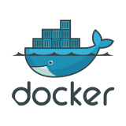
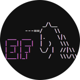

# 🚀 Microservices Web API Project

## 📋Overview

This is a **PET** project — a set of ASP.NET Core web APIs built as microservices.  
The main goal of the project is to gain hands-on experience with modern architectural practices  (Clean Architecture,
DDD, CQRS, event-driven communication, SAGA) and libraries or frameworks (EF Core, MediatR, MassTransit,
FluentValidation, etc.) . Each service follows DDD principles and is designed to be independently developed, tested, and
deployed.

## 🛠️ Tech Stack

<div align="center">

[](https://dotnet.microsoft.com/en-us/)
[](https://docs.microsoft.com/en-us/aspnet/core/?view=aspnetcore-8.0)
[](https://www.postgresql.org)
[](https://redis.io/)
[](https://www.rabbitmq.com/)
[](https://www.docker.com/)
[](https://learn.microsoft.com/en-us/ef/)
[](https://martendb.io/)
[](https://masstransit.io/)
[](https://github.com/LuckyPennySoftware/MediatR)
[](https://github.com/FluentValidation/FluentValidation)
[](https://github.com/MapsterMapper/Mapster)
[](https://github.com/CarterCommunity/Carter)
[](https://github.com/dotnet/yarp)
[](https://xunit.net/?tabs=cs)
[](https://nsubstitute.github.io/)
[](https://testcontainers.com/)
[](https://github.com/jbogard/Respawn)

</div>

## 📁 Project Structure

```
Server/
│   ├── src/
│   │   ├── Services/
│   │   │   ├── Basket/
│   │   │   │   └── Basket.API/
│   │   │   ├── Catalog/
│   │   │   │   ├── Catalog.API/
│   │   │   │   ├── Catalog.Application/
│   │   │   │   ├── Catalog.Core/
│   │   │   │   └── Catalog.Persistence/
│   │   │   ├── Ordering/
│   │   │   │   ├── Ordering.API/
│   │   │   │   ├── Ordering.Application/
│   │   │   │   ├── Ordering.Core/
│   │   │   │   └── Ordering.Persistence/
│   │   │   ├── Users/
│   │   │   │   ├── Users.API/
│   │   │   │   ├── Users.Application/
│   │   │   │   ├── Users.Core/
│   │   │   │   ├── Users.Infrastructure/
│   │   │   │   └── Users.Persistence/
│   │   ├── Shared/
│   │   │   ├── Shared.Core/
│   │   │   └── Shared.Messaging/
│   │   ├── APIGateways/
│   │   │   └── YarpGateway/
│   │   └── KeyManager/
│   ├── tests/
│   │   ├── Basket
│   │   │   ├── Basket.Tests.Unit/
│   │   │   └── Basket.Tests.Integration/
│   │   ├── Catalog
│   │   │   ├── Catalog.Tests.Unit/
│   │   │   └── Catalog.Tests.Integration/
│   │   ├── Ordering
│   │   │   ├── Ordering.Tests.Unit/
│   │   │   └── Ordering.Tests.Integration/
│   │   ├── Users
│   │   │   ├── Users.Tests.Unit/
│   │   │   └── Users.Tests.Integration/
│   │   ├── Shared
│   └── └── └── Shared.Core.Tests
├── docker-compose.yml
└── docker-compose.override.yml
```

### Services

#### 🛒 Basket Service

Basket is a lightweight microservice responsible for product cart actions. Stores minimal info about Product and
Category in one ProductCart object as JSON, using MartenDb ORM.
Reacts to product/category events in Catalog service.
Because its responsibility is small, I decided to implement it as a single project but separate all contexts using the
Clean Architecture principle. For this reason I also used MartenDb ORM because of the business logic simplicity and
lightweight service conception.

#### 📦 Catalog Service

Catalog is the largest microservice in the project responsible for Product and Category actions. Stores all info about
Product and Category aggregates in DB, using EF Core ORM. Also acts as a CDN server by storing Product/Category images
in the separate table `Images` as an aggregate with its own actions and endpoints.
Reacts to Ordering ReserveProduct event.

#### 📋 Ordering Service

Ordering is a microservice that handles the order lifecycle. Stores all info about Orders and minimal info about Product
aggregates in DB, using EF Core ORM. It also controls all stages of ordering, using Event-Driven approach and SAGA
pattern.
Reacts to product events in Catalog service.

#### 👥 Users Service

Users is a microservice responsible for all user and auth actions. Plays the role of the authentication server because
it contains all necessary information about User aggregate. Stores all info about the user in the DB, using EF Core ORM.
Performs authentication and authorization using JWT token with RSA signing and role-based hierarchy policies.
Here is the hierarchy:

```
Admin->Seller->Default
```

Works with SMTP server and sends emails with verification links to users.
Reacts to the CheckCustomer event in the Ordering service.

#### 🔑 KeyManager

KeyManager is a simple console project, that has only one purpose - create public and private keys for Users service.
Create keys in Server/secrets folder.

#### 🌐 YARP Gateway

Gateway of all microservices. Has rate limiter and SwaggerUI for development. Each microservice has its swagger Open Api
scheme, Yarp Gateway service unite all this schemes in one, format their routes to gateway and enable developer to use
one SwaggerUI for all microservices.

#### 🔧 Shared Libraries

Has two projects - `Shared.Core` and `Shared.Messaging`.

- `Shared.Messaging` contains only events class, shared DTOs and all data objects that are used for communication
  between services. It also has extension for adding MassTransit into api.
- `Shared.Core` contains shared logic and base classes. It has Fluent Validation abstractions, Result pattern
  implementation, and custom validators.
  `Shared.Core` describes all DDD abstractions like Entity<> and AggregateRoot<>, adds MediatR abstractions for CQRS
  implementation, configurations for logging and validation pipelines, pagination and envelope records and extension
  methods for shared authentication, authorization, swagger, etc.

## 🏗️ Architectural Principles

### DDD

I made an accent in **Rich Domain Model** approach.
My models have all their domain logic, like creating, updating, event dispathcing, etc.
Value objects have their logic too. They all have factory method `Create`, that returns `Result<TypeOfValueObject>`.
This method contains all validation logic , and if the validation process fails, it returns a `Result` object with all
errors; if not, it returns success `Result` with ValueObject in the `Value` field.
I decided to make ValueObject responsible for their own valid state becaus of:

1. **Single Responsablity Principle** - Domain models take responsibility only for **their state**, not all ValueObjects
   that they consist of.
2. **Always-Valid Domain Model** - Domain model consist of ValueObjects or entities, which are consist of ValueObjects
   too, so if all ValueObject are valid, the model is valid too.
3. **Infomation Expert Principle (GRASP)** - Value object contains all necessary information about itself to validate
   its state.

This type of validation is perfectly connected with the `FluentValdation` library using a special custom validator that
checks input using a factory method in a value object.

For example:

```csharp
public class UpdateOrderCommandValidator : AbstractValidator<UpdateOrderCommand>
{
    public UpdateOrderCommandValidator()
    {
        RuleFor(x => x.CustomerId)
            .MustBeCreatedWith(CustomerId.Create); // This is the custom validator that takes
                                                   // ValueObjects factory method, and checks
                                                   // it result.
        
        RuleFor(x => x.OrderId)
            .MustBeCreatedWith(OrderId.Create);
        
        RuleFor(x => x.Value.Payment)
            .MustBeCreatedWith((p) => Payment.Create(
                cardName: p.cardName,
                cardNumber: p.cardNumber,
                paymentMethod: p.paymentMethod,
                expiration: p.expiration,
                cvv: p.cvv
            )
        );
    }
}
```

I also was inspired by this article<sup>[1]</sup> and this video<sup>[2]</sup> about DDD validation.

### Clean Architecture

All services are built using this principle but with a feature for practical purposes.
This feature is the **EF Core** dependencies between the `Application` and `Persistence` layers.
Mostly when implementing the business logic (`Application`) layer with **Clean Architecture**, developers make an
IRepository interface that describes
all necessary methods to work with DB and`Presistence` layer implements it and places it in the dependency injection
pool,
so the `Application` layer is not dependent on the `Persistence` layer - which  **Clean Architecture** needs.

I did the same in the `Basket` service, but in rest of the services I made a trick. Because **EF Core** `DbSet` and
`DbContext`  implement **Repository** and **UnitOfWork** patterns already,
in the Application layer I would have to implement all interfaces for it, so a lot of boilerplate code had to be
written, and also my repositories cannot contain necessary **EF Core** logic like `Include` and `ThenInclude` methods.
I could write all that boilerplate, but I decided that it's not practical.

Instead, I add to the `Application` layer one package - `Microsoft.EntityFrameworkCore.Relational` and define
`IApplicationDbContext` interfaces -
where  `DbSets` and `SaveChangesAsync` methods are defined.
`Persistence` layer implements this interface and adds it to the dependency injection pool. This approach adds ORM
dependency to the `Application` layer, so it is harder to test, but it doesn't add a database one - `Application` layer still can use
any DB; ORM makes abstraction of the database itself.

### CQRS

I implement CQRS using **MediatR** library for making requests between `API` and `Application` layers.
I defined some interfaces for my commands and queries:
1. ```csharp
    public interface ICommandBase;
    public interface ICommand: IRequest<Result>, ICommandBase;
    public interface ICommand<TResponse> : IRequest<Result<TResponse>>, ICommandBase
    where TResponse : notnull;
    ```
2. ```csharp
    public interface ICommandHandler<in TCommand> 
        : IRequestHandler<TCommand, Result>
        where TCommand : ICommand {}

    public interface ICommandHandler<in TCommand, TResponse> 
        : IRequestHandler<TCommand, Result<TResponse>>
        where TCommand : ICommand<TResponse>
        where TResponse : notnull {}
    ```
3. ```csharp
    public interface IQuery<TResponse> : IRequest<Result<TResponse>>
        where TResponse : notnull {}
    ```
4. ```csharp
    public interface IQueryHandler<in TQuery, TResponse> :
        IRequestHandler<TQuery, Result<TResponse>>
        where TQuery : IQuery<TResponse>
        where TResponse : notnull {}
    ```
`ICommandHandler` accepts the `ICommand` interface, and if command has generic response - returns `Result<TypeOfResponse>` object otherwise - just `Result`.

`IQueryHandler` instead can return only `Result<TResponse>` because query always returns some type.

I also defined some behaviors in the **MediatR** pipeline: `ValidationBehaviour` and `LoggingBehaviour`.

`LoggingBehaviour` logs all commands and queries with their props, handle time, and result.

`ValidationBehaviour` takes all commands and queries validators from **FluentValidation** library, checks their results before execution, and if result is failure - returns it instead.


<!-- References -->
[1]: https://enterprisecraftsmanship.com/posts/validation-and-ddd/ "Validation and DDD — Article"
[2]: https://youtu.be/mMo8G3gCOtA?si=3LXKO0oUmEB4Nr2J&t=1497 "DDD validation — Video (timestamped)"

