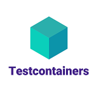

# 🚀 Microservices Web API Project 

## 📋Overview 
This is a **PET** project — a set of ASP.NET Core web APIs built as microservices.  
The main goal of the project is to gain hands-on experience with modern architectural practices  (Clean Architecture, DDD, CQRS, event-driven communication, SAGA) and libraries or frameworks (EF Core, MediatR, MassTransit, FluentValidation, etc.) . Each service follows DDD principles and is designed to be independently developed, tested, and deployed.

## 🛠️ Tech Stack
<div align="center">

[](https://dotnet.microsoft.com/en-us/)
[](https://docs.microsoft.com/en-us/aspnet/core/?view=aspnetcore-8.0)
[](https://www.postgresql.org)
[](https://redis.io/)
[](https://www.rabbitmq.com/)
[](https://www.docker.com/)
[](https://learn.microsoft.com/en-us/ef/)
[](https://martendb.io/)
[](https://masstransit.io/)
[](https://github.com/LuckyPennySoftware/MediatR)
[](https://github.com/FluentValidation/FluentValidation)
[](https://github.com/MapsterMapper/Mapster)
[](https://github.com/CarterCommunity/Carter)
[](https://github.com/dotnet/yarp)
[](https://xunit.net/?tabs=cs)
[](https://nsubstitute.github.io/)
[](https://testcontainers.com/)
[](https://github.com/jbogard/Respawn)

</div>


## 📁 Project Structure
```
Server/
│   ├── src/
│   │   ├── Services/
│   │   │   ├── Basket/
│   │   │   │   └── Basket.API/
│   │   │   ├── Catalog/
│   │   │   │   ├── Catalog.API/
│   │   │   │   ├── Catalog.Application/
│   │   │   │   ├── Catalog.Core/
│   │   │   │   └── Catalog.Persistence/
│   │   │   ├── Ordering/
│   │   │   │   ├── Ordering.API/
│   │   │   │   ├── Ordering.Application/
│   │   │   │   ├── Ordering.Core/
│   │   │   │   └── Ordering.Persistence/
│   │   │   ├── Users/
│   │   │   │   ├── Users.API/
│   │   │   │   ├── Users.Application/
│   │   │   │   ├── Users.Core/
│   │   │   │   ├── Users.Infrastructure/
│   │   │   │   └── Users.Persistence/
│   │   ├── Shared/
│   │   │   ├── Shared.Core/
│   │   │   └── Shared.Messaging/
│   │   ├── APIGateways/
│   │   │   └── YarpGateway/
│   │   └── KeyManager/
│   ├── tests/
│   │   ├── Basket
│   │   │   ├── Basket.Tests.Unit/
│   │   │   └── Basket.Tests.Integration/
│   │   ├── Catalog
│   │   │   ├── Catalog.Tests.Unit/
│   │   │   └── Catalog.Tests.Integration/
│   │   ├── Ordering
│   │   │   ├── Ordering.Tests.Unit/
│   │   │   └── Ordering.Tests.Integration/
│   │   ├── Users
│   │   │   ├── Users.Tests.Unit/
│   │   │   └── Users.Tests.Integration/
│   │   ├── Shared
│   └── └── └── Shared.Core.Tests
├── docker-compose.yml
└── docker-compose.override.yml
```
### Services
#### 🛒 Basket Service
Basket is a lightweight microservice responsible for product cart actions. Stores minimal info about Product and Category in one ProductCart object as JSON, using MartenDb ORM.
Reacts to product/category events in Catalog service.
Because its responsibility is small, I decided to implement it as a single project but separate all contexts using the Clean Architecture principle. For this reason I also used MartenDb ORM because of the business logic simplicity and lightweight service conception.
#### 📦 Catalog Service
Catalog is the largest microservice in the project responsible for Product and Category actions. Stores all info about Product and Category aggregates in DB, using EF Core ORM. Also acts as a CDN server by storing Product/Category images in the separate table `Images` as an aggregate with its own actions and endpoints.
Reacts to Ordering ReserveProduct event.
#### 📋 Ordering Service
Ordering is a microservice that handles the order lifecycle. Stores all info about Orders and minimal info about Product aggregates in DB, using EF Core ORM. It also controls all stages of ordering, using Event-Driven approach and SAGA pattern.
Reacts to product events in Catalog service.
#### 👥 Users Service
Users is a microservice responsible for all user and auth actions. Plays the role of the authentication server because it contains all necessary information about User aggregate. Stores all info about the user in the DB, using EF Core ORM.
Performs authentication and authorization using JWT token with RSA signing and role-based hierarchy policies.
Here is the hierarchy:
```
Admin->Seller->Default
```
Works with SMTP server and sends emails with verification links to users.
Reacts to the CheckCustomer event in the Ordering service.
#### 🔑 KeyManager
KeyManager is a simple console project, that has only one purpose - create public and private keys for Users service.
Create keys in Server/secrets folder.
#### 🌐 YARP Gateway
Gateway of all microservices. Has rate limiter and SwaggerUI for development. Each microservice has its swagger Open Api scheme, Yarp Gateway service unite all this schemes in one, format their routes to gateway and enable developer to use one SwaggerUI for all microservices.
#### 🔧 Shared Libraries
Has two projects - `Shared.Core` and `Shared.Messaging`. 
- `Shared.Messaging` contains only events class, shared DTOs and all data objects that are used for communication between services. It also has extension for adding MassTransit into api.
- `Shared.Core` contains shared logic and base classes. It has Fluent Validation abstractions, Result pattern implementation, and custom validators.
`Shared.Core` describes all DDD abstractions like Entity<> and AggregateRoot<>, adds MediatR abstractions for CQRS implementation, configurations for logging and validation pipelines,  pagination and envelope records and extension methods for shared authentication, authorization, swagger, etc.


